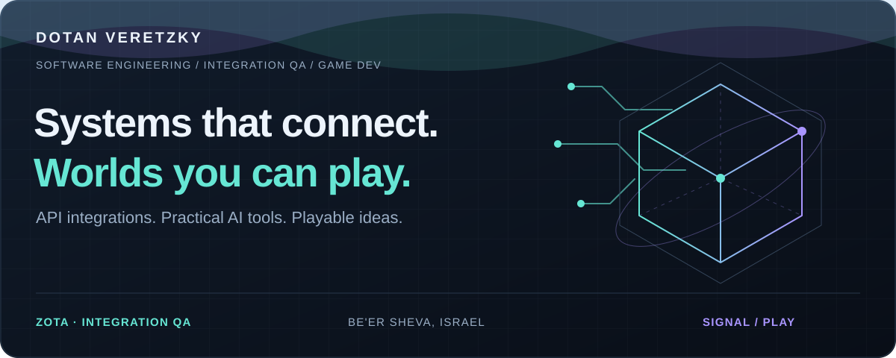
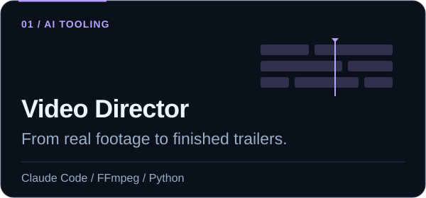
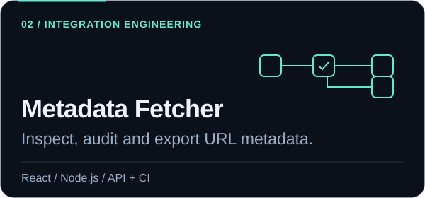
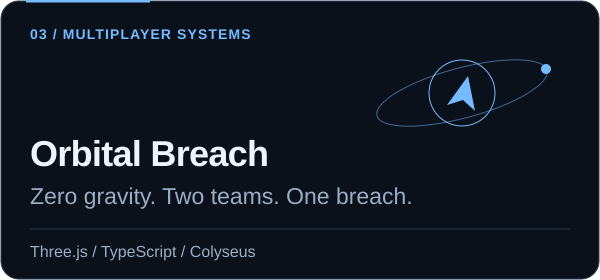
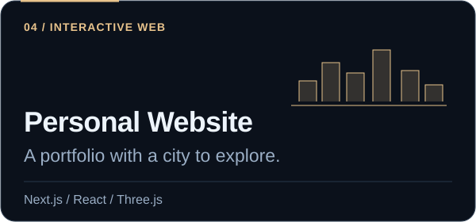
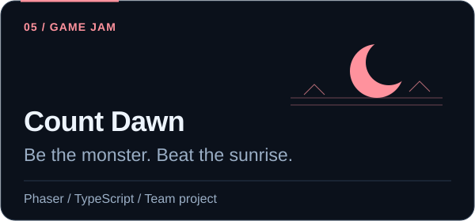
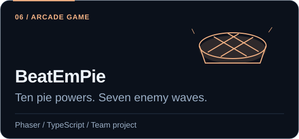

  

  

  <a href="https://dotanv.vercel.app/"><b>Explore my portfolio</b></a> ·
  <a href="https://dotanv.itch.io">Play my games</a> ·
  <a href="https://www.linkedin.com/in/dotan-v">LinkedIn</a> ·
  <a href="mailto:dotanvg@gmail.com">Email</a>

I'm **Dotan**, a software engineer and **Integration QA Specialist at Zota**, based in Be'er Sheva, Israel. My background is in Electronics & Computers practical engineering.

I work at the intersection of **API integrations, practical AI tools, and game development**. I'm interested in how systems behave at their edges, how to prevent regressions, and how to make a game feel good to play.

## Selected work

<table>
<tr>
<td width="50%" valign="top">

A reusable directing workflow with beat analysis, audio mastering and multiple aspect ratios.

<a href="https://github.com/DotanVG/video-director-skill"><b>Explore the skill →</b></a>

</td>
<td width="50%" valign="top">

Batch URL inspection, metadata previews, per-URL errors and JSON/CSV exports.

<a href="https://react-node-url-mdata-fetch-dotanv.netlify.app/"><b>Try the app →</b></a> · <a href="https://github.com/DotanVG/react-node-url-metadata-fetcher">Source</a>

</td>
</tr>
<tr>
<td width="50%" valign="top">

Online rooms, authoritative match state, AI pilots and touch controls in a zero-gravity arena.

<a href="https://orbital-breach.vercel.app"><b>Play in your browser →</b></a> · <a href="https://github.com/DotanVG/Orbital-Breach">Source</a>

</td>
<td width="50%" valign="top">

A conventional portfolio and a playable 3D city, with experience and education as landmarks.

<a href="https://dotanv.vercel.app/"><b>Explore the portfolio →</b></a> · <a href="https://github.com/DotanVG/Dotan-Personal-Website">Source</a>

</td>
</tr>
<tr>
<td width="50%" valign="top">

Reverse horde survival built with a team. My contribution: design, programming and game architecture.

<a href="https://count-dawn.vercel.app"><b>Beat the sunrise →</b></a> · <a href="https://github.com/DotanVG/Count-Dawn">Source &amp; credits</a>

</td>
<td width="50%" valign="top">

Shushki takes on fish and whales with magical pies. I handle programming, design and project management.

<a href="https://beat-em-pie.vercel.app/"><b>Drop some pies →</b></a> · <a href="https://github.com/DotanVG/BeatEmPie-Phaser">Source &amp; credits</a>

</td>
</tr>
</table>

## Behind the commits

  
  

  

   
  <b>Mini Dotan is on the case.</b> My animated companion also lives on <a href="https://dotanv.vercel.app/">my website</a>.

## What I work with

| Area | Tools and interests |
| :--- | :--- |
| **Integration & QA** | API validation, Postman, regression testing, edge cases |
| **Web & services** | TypeScript, JavaScript, React, Next.js, Node.js, Express |
| **Games & desktop** | Phaser, Three.js, Unity, C#, WPF |
| **AI & automation** | Claude Code, Codex, Python, reusable skills and workflows |
